# 2. PostGis

Enkh-Undral EnkhBayar

Instructions
Piate zadanie je zamerané na overenie vedomostí v oblasti PostGIS. Vašou úlohou bude vypracovať úlohy uvedené nižšie.
Zadanie sa odovzdáva do 9.11.2023 23:59 a dostanete za neho 10 bodov. Otázky 2-9 sú dokopy za 6 bodov (každá 0,75).
Otázky 10 - 13 je za 4 body (každá 1).

## 1. stiahnite a importujte si dataset pre Open Street mapy z https://download.geofabrik.de/europe/slovakia.html do novej DB

1. Stiahol som z https://download.geofabrik.de/europe/slovakia.html subor `slovakia-latest.osm.pbf`
2. Stiahol som z https://osm2pgsql.org/download/windows/ subor `osm2pgsql-latest-x64.zip` a rozbalil ho
3. Stiahol som z https://learnosm.org/files/default.style subor `default.style`
4. Vytvoril som novú databázu `osm_slovakia` v PostgreSQL s `CREATE DATABASE osm_slovakia;`
5. Nainstaloval som extension postgis s stack builderom
6. Pridal som extension do databázy s `CREATE EXTENSION postgis;` a `CREATE EXTENSION hstore;`
7. Spustil som príkaz na importovanie dát do databázy:

```
./osm2pgsql.exe --create --slim --hstore --latlong -d osm_slovakia -U postgres -W -S C:/Users/undy4/Downloads/default.style C:/Users/undy4/Downloads/slovakia-251106.osm.pbf
```

## 2. zistite aké kraje sú na Slovensku (planet_osm_polygon, admin_level = ‘4’) a vypíšte súradnice ťažiska ako text s longitude a latitude.

Zavolam funkciu `ST_Centroid` a prekonvertujem ju na text pomocou `ST_AsText`.

```sql
SELECT name,
       ST_AsText(ST_Centroid(way)) AS tazisko
FROM planet_osm_polygon
WHERE admin_level = '4';
```

a pouzil som tento vystup na zobrazenie tychto bodov v Geo vieweri na data gripe
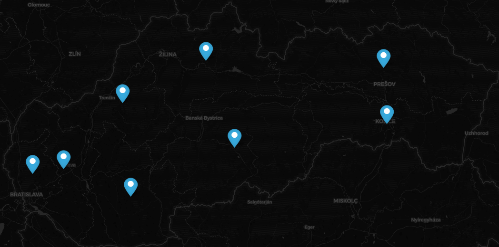

## 3. zoraďte kraje podľa ich veľkosti (st_area). Veľkosť vypočítajte pomocou vhodnej funkcie a zobrazte v km^2 v SRID 5514.

```sql
SELECT name,
       st_area(st_transform(way, 5514)) / 1000000 AS area_km2
FROM planet_osm_polygon
WHERE admin_level = '4'
order by area_km2;
```

| name                 | area_km2           |
|----------------------|--------------------|
| Bratislavský kraj    | 2051.6900913788086 |
| Trnavský kraj        | 4145.2509519107    |
| Trenčiansky kraj     | 4501.007201858133  |
| Nitriansky kraj      | 6342.459157679303  |
| Košický kraj         | 6750.868824299013  |
| Žilinský kraj        | 6806.080122304049  |
| Prešovský kraj       | 8971.239500496977  |
| Banskobystrický kraj | 9452.989813320133  |

## 4. pridajte si dom, kde bývate ako polygón (nájdite si súradnice napr. cez google maps) do planet_osm_polygon (znova pozor na súradnicový systém). Výsledok zobrazte na mape.

Suradnice som ziskal z google maps kde som na kraje klikol pravym tlacitkom a nasledne skopiroval suradnice. Dal som ich
do funckie `ST_GeomFromText` (musel som dat suradnice opacne lebo google maps dava suradnice v poradi latitude,
longitude a postgis to ocakava naopak). Nasledne som este skopiroval prvy bod aby som ukoncil polygon. Nakoniec som iba
zobrazil dom rovnako ako predtym.

```sql
-- Ziskanie maximalneho osm_id pre pridanie noveho záznamu
select max(osm_id)
from planet_osm_polygon;

-- Pridanie domu do planet_osm_polygon
INSERT INTO planet_osm_polygon (osm_id, name, building, way)
VALUES (1448060469,
        'Mlynska 7394',
        'yes',
        ST_GeomFromText('POLYGON((' ||
                        '16.972821505617702 48.21818066130518, ' ||
                        '16.972770543649517 48.218232935264, ' ||
                        '16.97290733630096 48.218290570592586, ' ||
                        '16.972957627716934 48.218242317763746,' ||
                        '16.972821505617702 48.21818066130518' ||
                        '))',
                        4326));

-- Zobrazenie pridaneho domu cez data grip geo viewer
SELECT name, way
FROM planet_osm_polygon
WHERE name = 'Mlynska 7394';
```

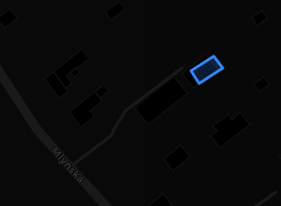

## 5. zistite v akom kraji je váš dom.

```sql
SELECT kraj.name
FROM planet_osm_polygon AS kraj,
     planet_osm_polygon AS dom
WHERE kraj.admin_level = '4'
  AND dom.name = 'Mlynska 7394'
  AND ST_Contains(kraj.way, dom.way);
```

`Bratislavský kraj`

## 6. pridajte si do planet_osm_point vašu aktuálnu polohu (pozor na súradnicovýsystém). Výsledok zobrazte na mape.

Rovnaky postup ako pri dome, len som pouzil planet_osm_point a `POINT`

```sql
select max(osm_id)
from planet_osm_point;

INSERT INTO planet_osm_point (osm_id, name, way)
VALUES (13286091436,
        'Moja poloha',
        ST_GeomFromText('POINT(16.97287545382493 48.2182570729315)', 4326));

SELECT name, way
FROM planet_osm_point
WHERE name = 'Moja poloha';
```

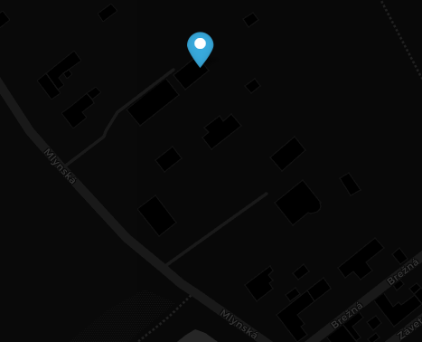

## 7. zistite či ste doma - či je vaša poloha v rámci vášho bývania.

```sql
SELECT ST_Contains(dom.way, poloha.way)
FROM planet_osm_polygon AS dom,
     planet_osm_point AS poloha
WHERE dom.name = 'Mlynska 7394'
  AND poloha.name = 'Moja poloha';
```

`true`

## 8. zistite ako ďaleko sa nachádzate od FIIT (name = 'Fakulta informatiky a informačnýchtechnológií STU'). Pozor na správny súradnicový systém – vzdialenosť musí byť čo najpresnejšia.

```sql
SELECT ST_Distance(
               poloha.way::geography,
               fiit.way::geography
       ) AS vzdialenost_v_metroch
FROM planet_osm_point AS poloha,
     planet_osm_polygon AS fiit
WHERE poloha.name = 'Moja poloha'
  AND fiit.name = 'Fakulta informatiky a informačných technológií STU';
```

Vysledkom je `10177.03412208`. Tato vzdialenost je v metroch. Vysledok som si skontroloval na google maps a sedi to.

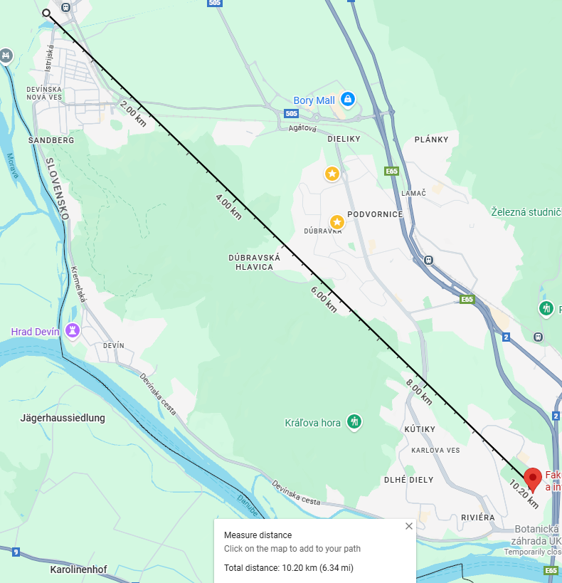

## 9. stiahnite si QGIS a vyplotujte kraje a váš dom z úlohy 2 na mape - napr. červenou čiarou.

1. Stiahnem si qgis z https://qgis.org/download/ a nasledne nainstalujem pluginy `QuickMapServices` a `QuickOSM`
2. Web | QuickMapServices | OSM | OSM Standard (tymto zapnem mapy)
3. Pripojim sa na databazu cez `Vrstva` | `Pridat vrstvu` | `Add PostgreSQL Layer` a pridam login db a host
   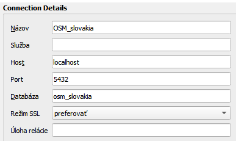
4. Kliknem na `planet_osm_polygon` a kliknem na `Nastavit filter` a dam `admin_level = '4'`
   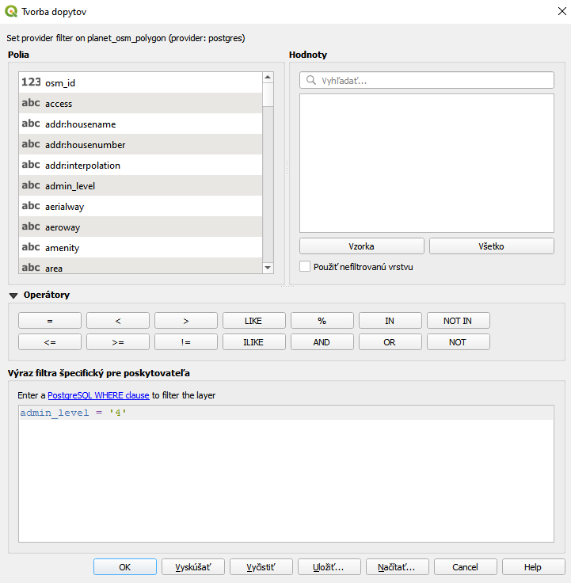
5. Nasledne vytvorim novu vrstvu pre dom rovnako ako predtym len dam filter `name = 'Mlynska 7394'`
6. Zmenim farbu krajov tym ze kliknem stvorec a zmenim na cerveny outline
   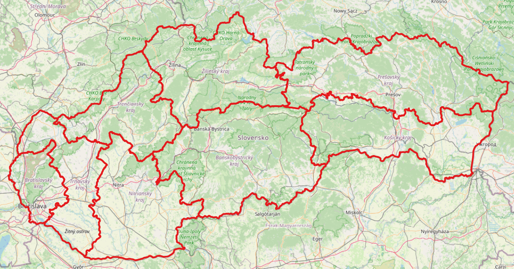
   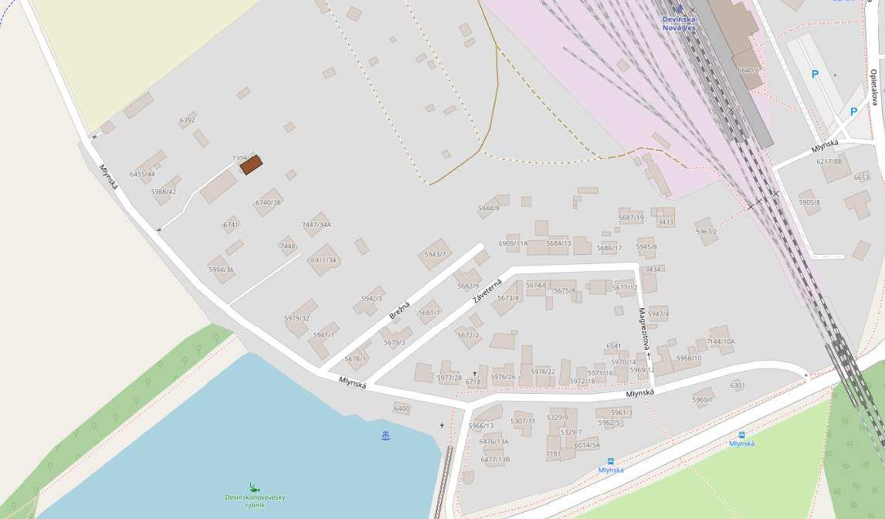

## 10. zistite súradnice centroidu (ťažiska) plošne najmenšieho okresu (vo výsledku nezabudnite uviesť aj EPSG kód súradnicového systému).

```sql
SELECT name,
       ST_AsText(ST_Centroid(way))                          AS centroid_coordinates,
       ST_Area(ST_Transform(way, 5514)::geometry) / 1000000 AS area_km2,
       'EPSG:4326'                                          AS srid
FROM planet_osm_polygon okres
WHERE admin_level = '8'
  and lower(name) like 'okres%'
order by area_km2 limit 1;
```

| name               | centroid_coordinates                        | area_km2          | srid      |
|--------------------|---------------------------------------------|-------------------|-----------|
| okres Bratislava I | POINT(17.09941358396995 48.150979471788965) | 9.590352956411394 | EPSG:4326 |

## 11. vytvorte priestorovú tabuľku všetkých úsekov ciest, ktoré sa celé nachádzajú do 10 km od vzájomnej hranice okresov Malacky a Pezinok. Vytvorte ďalšiu tabuľku, ktorá bude obsahovať len tie úseky ciest, ktoré pretínajú túto hranicu okresov alebo sa jej dotýkajú. Výsledky overte ich zobrazením v prostrední QGIS.

```sql
-- Vytvorenie tabulky hranice okresov Malacky a Pezinok
SELECT ST_Intersection(ma.way, pk.way) AS geom
into hranica_okresov
FROM planet_osm_polygon AS ma,
     planet_osm_polygon AS pk
WHERE ma.name = 'okres Malacky'
  AND ma.admin_level = '8'
  AND pk.name = 'okres Pezinok'
  AND pk.admin_level = '8';

-- Vytvorenie tabulky buffer s okruhom 10 km okolo hranice
SELECT ST_Buffer(hranica_okresov.geom::geography, 10000) ::geometry AS geom
into buffer_hranice
FROM hranica_okresov;

-- 1. Cast
SELECT cesta.*
INTO cesty_v_okoli_hranice
FROM planet_osm_roads AS cesta,
     buffer_hranice
WHERE ST_Within(cesta.way, buffer_hranice.geom);

-- 2. Cast
SELECT cesta.*
INTO cesty_pretinajuce_hranicu
FROM planet_osm_roads AS cesta,
     hranica_okresov
WHERE ST_Intersects(cesta.way, hranica_okresov.geom);
```

### Hranica spolu s 10km bufforom

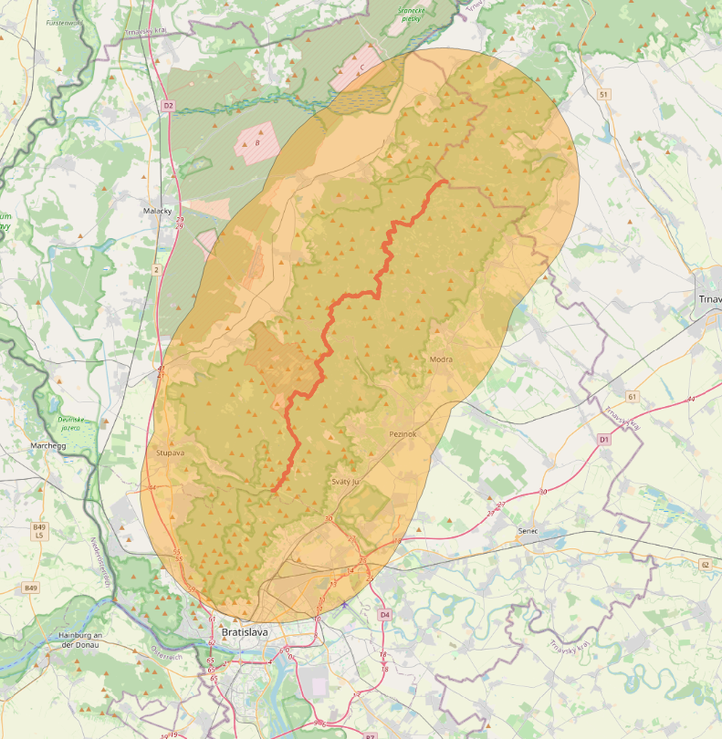

### Cesty v 10 km okoli hranice

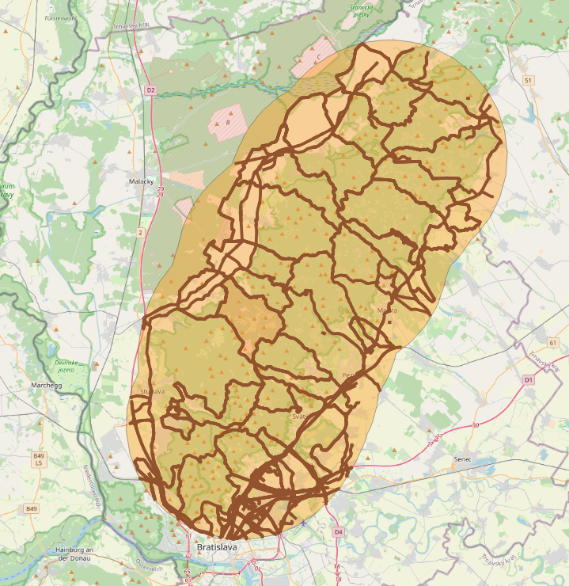

### Cesty pretinajuce hranicu

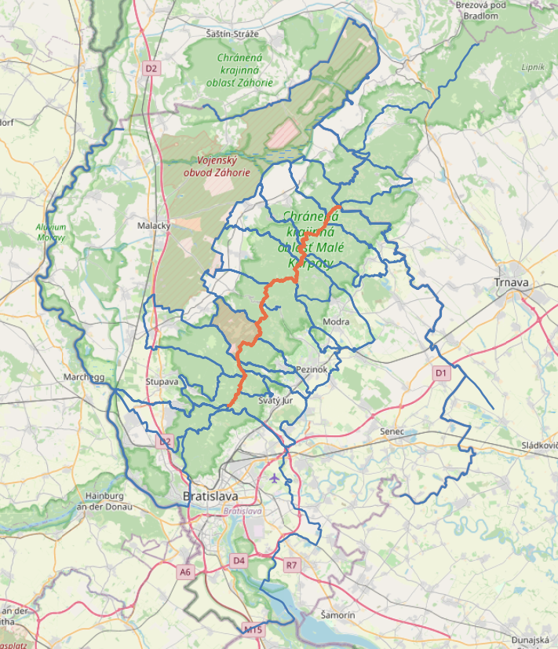

## 12. jedným dopytom zistite číslo a názov katastrálneho územia (z dát ZBGIS, https://www.geoportal.sk/sk/zbgis_smd/na-stiahnutie/), v ktorom sa nachádza najdlhší úsek cesty (z dát OSM) v okrese, v ktorom bývate.

Stiahol som gpkg subor
z https://www.gku.sk/gku/produkty-sluzby/na-stiahnutie/zbgis.html#:~:text=CC-BY%204.0-,Geografické%20názvoslovie,-Formát
lebo link v zadani nefunguje. Nasledne som ho presunul do ` ~/AppData/Local/Programs/OSGeo4W/bin/ ` a spustil tento
prikaz na importovanie do db.
```bash
 ./ogr2ogr.exe -f PostgreSQL "PG:dbname=osm_slovakia user=postgres password=*****" ./USJ_hranice_0.gpkg
```

```sql
select st_length(st_intersection(roads.way, st_transform(kataster.shape, 4326)::geometry)::geography) as len_m,
        roads.way,
        kataster.idn5,
        kataster.nm5
from planet_osm_polygon AS dom
         join
     planet_osm_polygon AS okresy on okresy.admin_level = '8' and st_within(dom.way, okresy.way::geometry)
         join
     planet_osm_roads AS roads on st_within(roads.way, okresy.way::geometry)
         join
     ku_0 kataster on st_intersects(roads.way, st_transform(kataster.shape, 4326)::geometry)
where 1 = 1
  and dom.name = 'Mlynska 7394'
order by len_m desc
limit 1;
```
Select ale trva minimalne hodinu takze som to nedokazal dobehnut.

## 13. vytvorte oblasť Okolie_Bratislavy, ktorá bude zahŕňať zónu do 20 km od Bratislavy, ale nebude zahŕňať oblasť Bratislavy (Bratislava I až Bratislava V) a bude len na území Slovenska. Zistite jej výmeru.

```sql
SELECT st_difference(st_intersection(
                             slovensko.way,
                             ST_Buffer(
                                     bratislava.way::geography,
                                     20000
                             )::geometry),
                     bratislava.way) as way
INTO bratislava_okolie
from planet_osm_polygon slovensko,
     planet_osm_polygon bratislava
where 1 = 1
  and slovensko.admin_level = '2'
  and slovensko.name = 'Slovensko'
  and bratislava.admin_level = '6'
  and bratislava.name = 'Bratislava';


select ST_Area(ST_Transform(a.way, 4326)::geography) / 1000000 as area_km2
from bratislava_okolie a;
```

Najprv som vytvoril buffer 20 km okolo bratislavy, dal som intersection s slovenskom a nakoniec som odstranil
bratislavu.
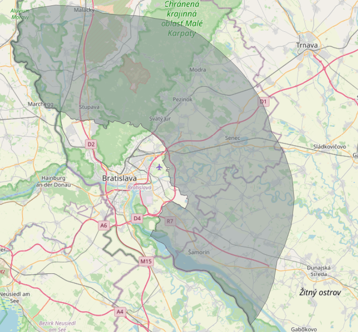

Nasledne som pouzil druhy select na zistenie vymery oblasti a dostal som odpovedat `1480.1274899031448` km2

## Výstup

Výstup zadania je realizovaný formou protokolu, kde odpovedáte na jednotlivé otázky. Odpoveď pozostáva z SQL kódu,
obrázku výstupu, mapy a zdôvodnenia. Protokol musí ďalej obsahovať všetky formálne náležitosti:
Znenie zadania
Meno a priezvisko riešiteľa
Záver, kde zhodnotíte najväčšie úskalia a čo sa podarilo/nepodarilo realizovať.